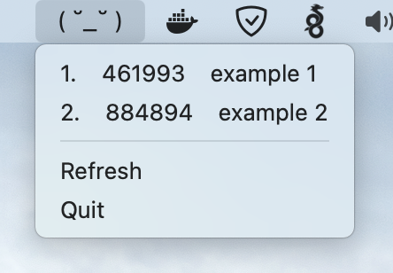

# ihate2fa

This is a tool to generate OTP codes from system tray. Secrets are stored in a system keychain.

### Install
```bash
go install github.com/IlyaFloppy/ihate2fa/cmd/ihate2fa
```

### Add OTP's
```bash
ihate2fa --add="otpauth-migration://offline?data=..." # replace link
```

### Generate OTP's
All OTP's:
```bash
ihate2fa --gen
1.  example1: 314246
2.  example2: 284223
```

Single OTP:
```bash
ihate2fa --acc="example1"
314246
```

### Run in tray
```bash
ihate2fa --tray
```

